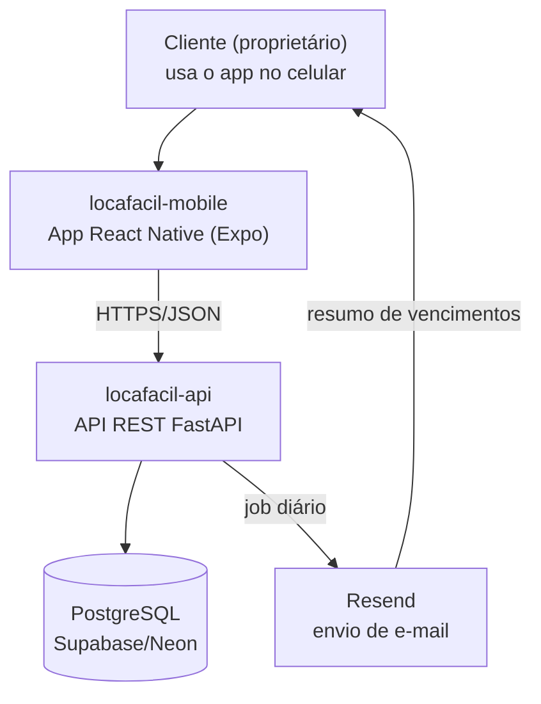

# Arquitetura — LocaFácil

## Visão geral (C4 — Nível 1: Contexto)



## Contêineres (Nível 2)

- **locafacil-mobile**: app React Native (Expo), consome a API via HTTPS. Repositório e ciclo de deploy independentes do backend.
- **locafacil-api**: API REST em FastAPI, hospedada no Render/Railway. Concentra toda a regra de negócio (cálculo de saldo devedor, alocação de pagamentos, geração de parcelas, alertas).
- **PostgreSQL**: banco relacional gerenciado (Supabase ou Neon, camada gratuita).
- **Resend**: serviço externo de envio de e-mail transacional, acionado por um job agendado dentro da própria API.

## Componentes do backend (Nível 3) — arquitetura em camadas

```
app/
├── api/            → routers (rotas HTTP, validação de entrada, sem regra de negócio)
├── services/        → regras de negócio (cálculo de saldo, alocação de pagamento, geração de parcelas)
├── repositories/     → acesso a dados (queries SQLAlchemy)
├── models/           → entidades de domínio (SQLAlchemy models)
├── schemas/          → contratos de entrada/saída (Pydantic)
└── jobs/              → tarefas agendadas (notificação diária via APScheduler)
```

**Fluxo de uma requisição típica** (registrar pagamento):

```
Router (api/) → recebe o request e valida o schema
   ↓
Service (services/) → aplica a regra de alocação de pagamento
   ↓
Repository (repositories/) → persiste Pagamento e atualiza Parcelas
   ↓
Response → devolve o novo status do contrato
```

Essa separação existe para que a regra de negócio (ex: "abater a dívida mais antiga primeiro") não fique espalhada nem duplicada entre rotas — ela mora só na camada de service, e é reutilizável tanto por endpoints da API quanto pelo job de notificação.

## Por que multi-repo (backend e frontend separados)

- O app mobile e um eventual frontend web consomem a mesma API sem nenhuma mudança no backend.
- Deploys independentes: alterar o app não exige redeploy da API, e vice-versa.
- Contrato entre os dois lados é a própria API REST, documentada automaticamente via OpenAPI/Swagger (`/docs` no FastAPI).
