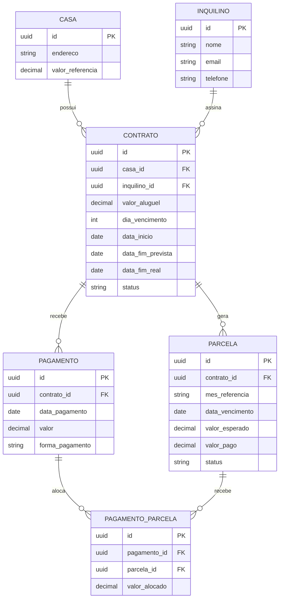

# Diagrama Entidade-Relacionamento — LocaFácil

> Este diagrama é escrito em Mermaid e renderiza automaticamente na visualização do GitHub.

## Notas de modelagem

- **Parcela** é gerada automaticamente todo mês para cada contrato ativo (`valor_esperado` = `valor_aluguel` do contrato no momento da geração).
- **Pagamento** representa o valor recebido de fato (evento financeiro real, ex: um Pix).
- **PagamentoParcela** é a tabela de alocação: registra como cada pagamento foi distribuído entre parcelas, sempre da mais antiga em aberto para a mais recente. Isso mantém o histórico auditável (dá pra ver exatamente qual pagamento cobriu qual mês).
- O **saldo devedor** de um contrato é calculado (não armazenado diretamente) como: soma de `valor_esperado` de todas as parcelas do contrato menos soma de `valor_pago`.
- `status` da parcela (pago / parcial / atrasado / pendente) pode ser calculado em tempo real pela regra de negócio, sem precisar ser persistido — evita inconsistência.
